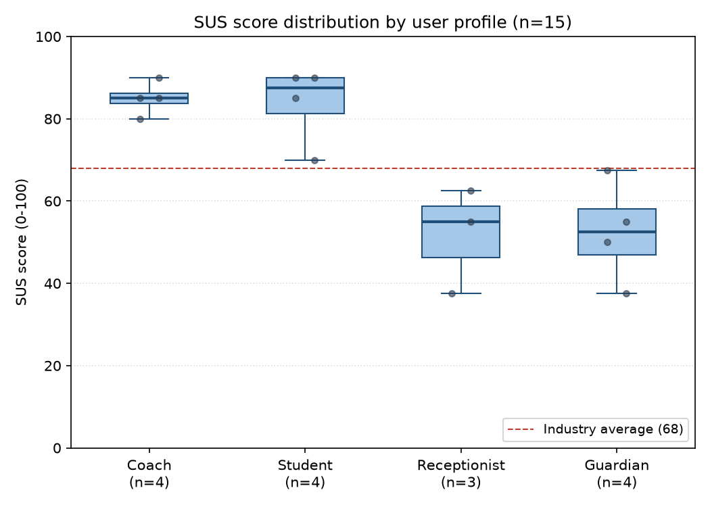

# Interpretación del SUS — análisis escrito

`REPORT.md` lo **regenera** `scripts/sus-analysis.py` en cada corrida: todo lo
que se escriba allí a mano se pierde al agregar un participante. Por eso el
análisis vive aquí, donde ningún script lo sobrescribe. Los números
corresponden a la corrida con **n = 15** (2026-08-18); si se agregan
respuestas, hay que actualizarlos a mano.

## Resultado agregado

Con 15 participantes externos, la media SUS es **69,33** (IC 95 %
58,87 – 79,79; DT 18,89; mediana 70,00), grado **C (Aceptable)** en la escala
adjetival de Bangor, Kortum y Miller (2009).

El intervalo se calcula con la t de Student (2,145 para 14 grados de
libertad), no con 1,96: con una muestra de 15 la aproximación normal
subestima la incertidumbre real.

La media cruza el umbral de 68 por 1,33 puntos. No se reporta como un
aprobado cómodo: el intervalo de confianza todavía incluye valores por debajo
de 68, así que la afirmación defendible es "la mejor estimación puntual está
por encima del umbral", no "el sistema supera el umbral".

La muestra creció en dos tandas y conviene mirar qué se movió:

| | n = 10 | n = 14 | n = 15 |
|---|---|---|---|
| Media | 68,25 | 68,57 | **69,33** |
| Amplitud del IC 95 % (t de Student) | 31,7 pts | 22,3 pts | **20,9 pts** |

La media se movió 1,08 puntos en total mientras la muestra creció un 50 %. Lo
que mejoró no fue el resultado sino la precisión: el intervalo se estrechó en
torno a un tercio. Eso es lo esperable cuando la estimación inicial ya era estable, y es el
argumento honesto para haber ampliado la muestra: no se buscaba subir la nota,
se buscaba reducir la incertidumbre.

## Patrón por perfil — el hallazgo principal

_Diagrama de caja generado por `scripts/sus-boxplot.py` a partir de
`respuestas.csv`. Los dos bloques (Coach/Student por encima de la media
de la industria; Receptionist/Guardian por debajo) se ven de un vistazo
sin necesidad de leer la tabla de abajo._

La distribución es marcadamente bimodal y se explica por el **rol** del
participante, no por variación individual:

| Perfil | n | Puntuaciones SUS | Promedio |
|---|---|---|---|
| Entrenador | 4 | 80,0 / 85,0 / 85,0 / 90,0 | **85,0** |
| Estudiante | 4 | 70,0 / 85,0 / 90,0 / 90,0 | **83,8** |
| Representante | 4 | 37,5 / 50,0 / 55,0 / 67,5 | **52,5** |
| Recepcionista | 3 | 37,5 / 55,0 / 62,5 | **51,7** |

Los cuatro perfiles se parten en dos bloques con muy poca dispersión interna:
**1,2 puntos** de diferencia dentro del grupo alto, **0,8** dentro del bajo, y
**33,3 entre ambos** — más de una vez y media la amplitud del intervalo de
confianza. No es ruido de muestreo.

Lo que separa a los dos grupos no es ser interno o externo a la escuela: el
recepcionista es personal interno y de uso diario, y puntúa igual de bajo que
el representante. La línea divisoria es **qué hace cada rol con el sistema**.
Entrenador y estudiante sobre todo *consultan* —ver sesiones, marcar
asistencia, revisar el equipo—, y esos son los flujos que más atención de
diseño recibieron. Recepcionista y representante *operan o esperan
información*: el primero da de alta, edita y cobra; el segundo busca
visibilidad sobre su representado y hoy el sistema no le envía nada por
iniciativa propia (RF-22 sigue sin implementarse; solo existe el registro de
consentimiento que lo habilitará).

Dicho de otro modo: **quien peor califica el sistema es quien más trabajo
administrativo hace con él.**

El patrón resistió dos ampliaciones sucesivas de la muestra. Los cinco
participantes agregados —dos estudiantes, dos representantes y un
entrenador— cayeron cada uno en el bloque que su rol predecía, sin excepción.
Que sobreviva a un crecimiento del 50 % lo vuelve difícil de atribuir al azar.

## Amenazas a la validez

### Tamaño de muestra

n = 15 cumple el mínimo exigido por la guía de la Entrega Final y supera con
holgura el mínimo de 10 del instrumento (Brooke, 1996). No permite, sin
embargo, generalizar con confianza a la población total de usuarios.

Para los subgrupos la limitación es mayor: con 3 o 4 participantes por perfil,
los promedios por rol son indicativos y no soportan una prueba de hipótesis
entre grupos. El patrón bimodal se sostiene por su magnitud (33,3 puntos) y
por su consistencia al ampliar la muestra, no por significancia estadística.
Afirmar lo contrario con estos n sería sobreinterpretar.

### Intervalo de confianza

El IC 95 % abarca 20,9 puntos e incluye valores por debajo del umbral de 68.
La estimación puntual es la mejor disponible, no un resultado concluyente.

### Sesgo de selección

Los participantes fueron contactados directamente por el equipo, sin muestreo
aleatorio. Quienes aceptaron podrían tener una opinión sistemáticamente
distinta del promedio de la población objetivo. El consentimiento informado
(`docs/etica/consentimiento/plantilla.md`) garantiza voluntariedad, pero no
elimina este sesgo.

### Media agregada frente a distribución bimodal

Reportar 69,33 como resultado único describe mal el sistema: **ningún perfil
puntúa cerca de 69**. Es el promedio de dos poblaciones separadas por 33
puntos. Por eso la tabla por perfil se reporta junto a la media agregada y no
como anexo.

## Notas metodológicas

**Etiquetas de perfil.** Los perfiles recolectados (entrenador, estudiante,
recepcionista, representante) son más específicos que las tres categorías
genéricas del instrumento original (administrativo, entrenador, externo). Se
preservan por ser más informativas, en vez de forzarlas a las categorías
originales. La única corrección aplicada es la unificación descrita abajo.

**Unificación de `padre de familia` en `representante` (2026-08-18).** Las
respuestas llegaron en tandas con etiquetas distintas para el mismo rol:
ENC-04 y ENC-08 como `padre de familia`, ENC-14 y ENC-16 como `representante`.
Se unificaron bajo `representante`, que es como el sistema nombra ese rol,
**por confirmación explícita de quien aplicó los cuestionarios**; no fue una
decisión de análisis.

El cambio afecta solo a la etiqueta: ninguna puntuación se modificó y los
estadísticos agregados son idénticos antes y después. Lo que cambia es la
lectura por perfil: el grupo pasa de dos subgrupos de n=2 (43,8 y 61,2) a uno
de n=4 con media 52,5, que queda junto a recepcionista en vez de aparentar una
posición intermedia que era un artefacto de la etiqueta.

**Numeración.** Los identificadores van de ENC-01 a ENC-10 y de ENC-13 a
ENC-17: **no existen ENC-11 ni ENC-12**. El salto se conserva tal como
llegaron los datos en vez de renumerar, para no dar la impresión de una serie
continua que no lo es.
